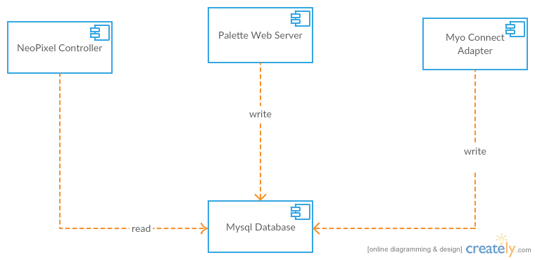

#Software Structure
The software stucture is shown below:

There are three main modules:
1. The NeoPixel Controller: This modules update the light color with data from mysql database. We implemented four Visual Effects in this module.
2. The palette web server: This modules serves a palette web page. Users can visit the page and change the color and brightness of the Neo Pixel. The selected color will be converted to RGB value and stored into mysql database.
3. The Myo Connect Adapter: This module is used to interface the Myo Connect. We use an official python library PyoConnect 1.0 to implement this. When the Myo Connect is unlocked, user can use double click gesture to switch between diffrent visual effects.

#Communicaion
A Mysql database is used to store the current visual effect and RGB values. There are several advantages of doing this.
1. Different modules are decoupled. They don't need to know anything about other modules.
2. The three modules are heterogeneous which means they are implemented in three different languages. And mysql is easy to integrated in all of these languages
3. sql is an easy to learn language

