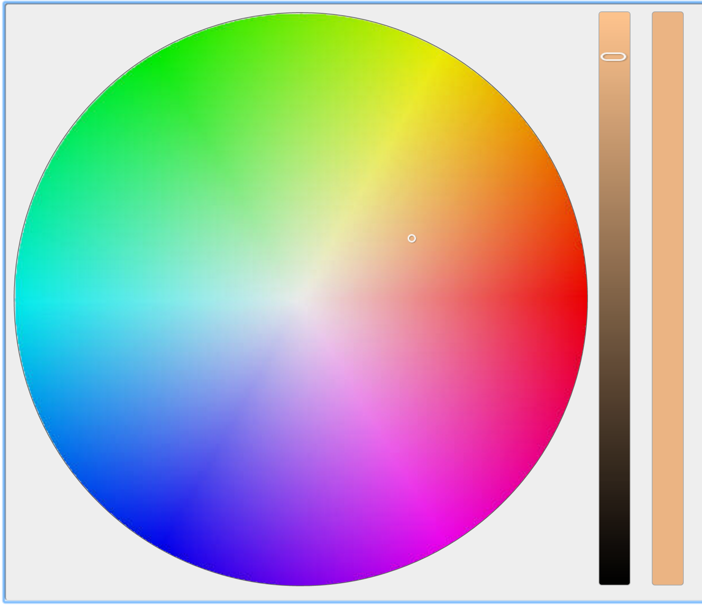

#Simple Light server

This server is implemented with nodejs and mysql. The user is able to control the color of the light with a web palette as shown below:

In SimpleLight.js I implement the server. First, I use the express library to implement the web serving. When a user visit the server at port 3000, The server will respond with a web page SimpleLight.html. Sencodly, I use socket.io to implement the communication between the web palette and server. In SimpleLight.html there are Javascript like this:
```javascript
var socket = io();
//socket.emit('init');
socket.on('init',function(msg){
	hsv = $.fn.wheelColorPicker.rgbToHsv(msg.r,msg.g,msg.b);
	console.log(hsv,msg);
	$('#color-block').wheelColorPicker('setColor',hsv);	
});
updateLight = function(){
selectedColor = $('#color-block').wheelColorPicker('getColor');
updatePacket = {'Red':selectedColor.r, 'Green':selectedColor.g, 'Blue':selectedColor.b};
//console.log(updatePacket);
socket.emit('light update',updatePacket);
}
timer = setInterval(updateLight,100);
```
In this code a socket.io connection is established between the browser and server. The selected color in palette is updated every 100 ms. On the server side, the update is handled and new color is written in to a mysql database.
